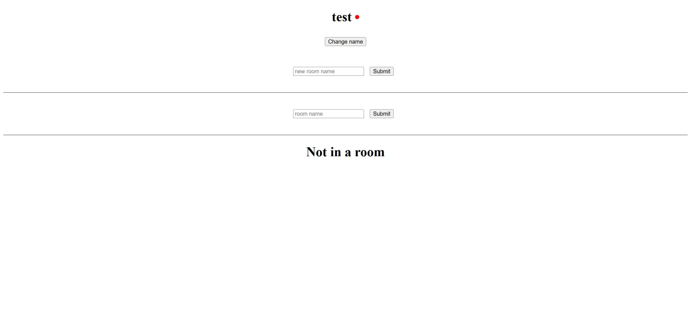
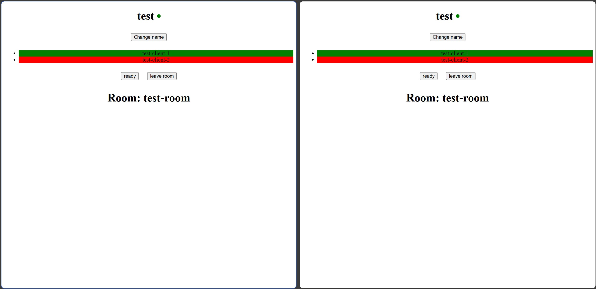
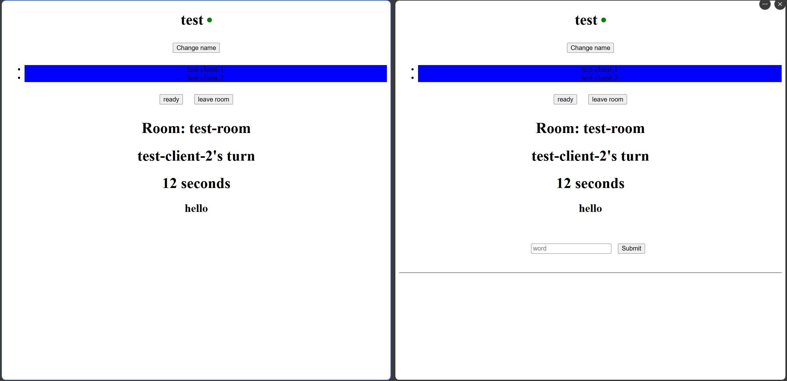
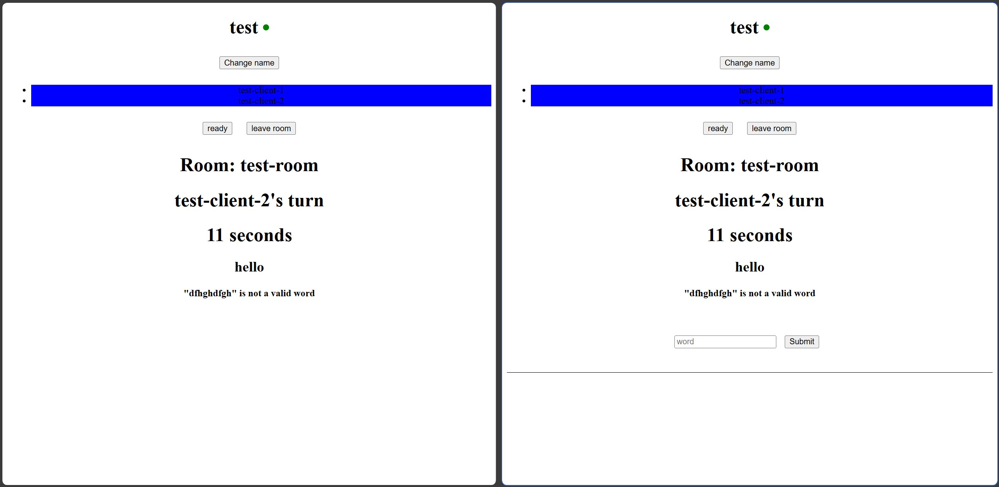
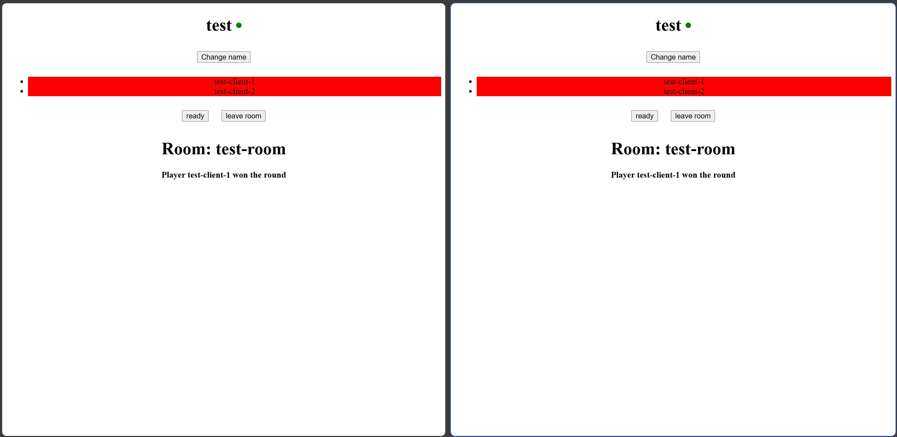

# WordsGame

A real-time multiplayer word game built with Node.js, Express.js, Socket.IO, and TypeScript. This project features a robust server-side architecture with external API integration, Redis caching, and real-time communication.

## 🎮 Features

- **Real-time Multiplayer**: Live gameplay using Socket.IO for instant communication
- **Room-based Games**: Players can join different game rooms for organized matches
- **Round Management**: Structured game rounds with proper state management
- **External API Integration**: Dictionary API integration for word validation
- **Redis Caching**: High-performance caching for improved response times
- **Type Safety**: Full TypeScript implementation for better code reliability
- **Event-driven Architecture**: Clean separation of concerns using event handlers


## 📸 Game Screenshots

### Server Disconnected

*Client interface when server connection is lost*

### Room Not Ready

*Players in room with red status - not ready to start the game*

### Game Running

*Active gameplay with players in blue status - game in progress*

### Invalid Word Submission

*Error message displayed when player submits an invalid word*

### Game Over

*Final scoreboard showing game results and winner*


## 🎨 Player Status Colors

The game uses a color-coded system to indicate player status:

| Color | Status | Description |
|-------|--------|-------------|
| 🔴 **Red** | Not Ready | Player has joined but is not ready to start |
| 🟢 **Green** | Ready | Player is ready and waiting for game to begin |
| 🔵 **Blue** | Playing | Player is actively participating in the current round |
| ⚫ **Gray** | Eliminated | Player has been eliminated from the current game |


## 🛠️ Tech Stack

### Backend
- **Node.js & Express.js** - Server runtime and web framework
- **TypeScript** - Type-safe JavaScript development
- **Socket.IO** - Real-time bidirectional event-based communication
- **Redis** - In-memory data structure store for caching
- **Dictionary API** - External word validation service

### Frontend (Temporary)
- **HTML5 & JavaScript** - Basic client interface for testing
- **Socket.IO Client** - Real-time server communication

> **Note**: The current HTML/JS client is temporary and will be replaced with an Angular interface in future releases.


## 📋 Prerequisites

Before running this project, make sure you have the following installed:

- [Node.js](https://nodejs.org/) (v14 or higher)
- [npm](https://www.npmjs.com/)
- [Redis](https://redis.io/) server
- TypeScript compiler (`npm install -g typescript`)


## 🚀 Installation

1. **Clone the repository**
   ```bash
   git clone https://github.com/abdoalmowafy/WordsGame-expressJs-socket.io.git
   cd WordsGame-expressJs-socket.io
   ```

2. **Navigate to server directory and install dependencies**
   ```bash
   cd server
   npm install
   ```

3. **Set up environment variables**
   Create and update the `.env` file in the `server` directory:
   ```env
   PORT=3000
   REDIS_OPTIONS=`{
      "username": "your_username",
      "password": "your_server",
      "socket": {
         "host": "your_server_host",
         "port": your_server_port
      }
   }`
   ```


## 📁 Project Structure

```
WordsGame/
├── server/
│   └── src/
│       ├── events/                 # Socket.IO event handlers
│       │   ├── room.ts            # Room management events (createRoom/joinRoom/leaveRoom)
│       │   ├── round.ts           # Game round events (tryStartRound/submitWord/findSetNextPlayerRandomly/eliminatePlayer/endRound)
│       │   ├── sockets.ts         # Main socket configuration
│       │   └── user.ts            # User-related events (connect/disconnect/changeName/readyToggle)
│       ├── models/                # Data models and interfaces
│       │   ├── player.ts          # Player model definition
│       │   ├── room.ts            # Room model definition
│       │   └── round.ts           # Round model definition
│       ├── redis.ts               # Redis configuration
│       ├── server.ts              # Main server entry point
│       ├── validateWordService.ts # Dictionary API integration
│       ├── .env                   # Environment variables
│       ├── .gitignore            # Git ignore rules
│       ├── package.json          # Dependencies and scripts
│       ├── package-lock.json     # Dependency lock file
│       └── tsconfig.json         # TypeScript configuration
├── client/                        # Temporary client interface
│   ├── test.html                 # Test client HTML
│   └── test.js                   # Test client JavaScript
└── README.md                     # Project documentation
```


## 🔧 Server Architecture

### Core Components

- **`server.ts`** - Main application entry point, Express server setup
- **`redis.ts`** - Redis client configuration and connection management
- **`validateWordService.ts`** - External dictionary API integration service

### Event System

The application uses a modular event-driven architecture:

- **`events/sockets.ts`** - Main Socket.IO configuration and connection handling
- **`events/user.ts`** - User authentication and profile management events
- **`events/room.ts`** - Game room creation, joining, and management events
- **`events/round.ts`** - Game round lifecycle and gameplay events

### Data Models

- **`models/player.ts`** - Player data structure and methods
- **`models/room.ts`** - Game room state and configuration
- **`models/round.ts`** - Round management and scoring logic


## 🎮 Socket Events

### Room Management
- `create-room` - Create a new game room
- `join-room` - Join an existing room
- `leave-room` - Leave current room
- `room-info` - Get room details and player list

### Game Flow
- `start-round` - Begin a new game round
- `submit-word` - Submit a word for validation
- `round-ended` - Round completion notification
- `game-over` - Game finished with final scores

### User Events
- `user-connected` - Player connection established
- `user-disconnected` - Player left the game
- `player-ready` - Player ready for next round


## 🚀 Development

### Starting the Development Server
```bash
cd server
npm run dev
```


### Testing the Client
1. Start the server
```bash
cd server
npm run dev
```
2. Open `client/test.html` in your browser
3. Open browser developer tools to see console logs
4. Test the game functionality


## 🎯 API Integration

The `validateWordService.ts` handles external dictionary API calls for word validation. Ensure you have a valid API key configured in your environment variables.


## 🎮 How to Play

1. **Open the client** - Launch `client/test.html` in your browser
2. **Connect to server** - The client automatically connects via Socket.IO
3. **Join a room** - Create or join an existing game room
4. **Wait for players** - Game starts when enough players are ready
5. **Submit words** - Enter new valid word during your turn or be eliminated
6. **Win the game** - Last player standing wins the game


## 🔮 Future Enhancements

- [ ] **Angular Frontend** - Replace temporary client with full Angular application
- [ ] **User Authentication** - Add proper login/registration system
- [ ] **Persistent Scores** - Store player statistics and rankings
- [ ] **Multiple Game Modes** - Add different word game variations
- [ ] **Admin Panel** - Room management and monitoring tools
- [ ] **Mobile Optimization** - Responsive design for mobile devices
- [ ] **Spectator Mode** - Allow users to watch ongoing games


## 🤝 Contributing

1. Fork the repository
2. Create a feature branch (`git checkout -b feature/amazing-feature`)
3. Make your changes in the appropriate directory (`server/src` for backend, `client` for frontend)
4. Commit your changes (`git commit -m 'Add some amazing feature'`)
5. Push to the branch (`git push origin feature/amazing-feature`)
6. Open a Pull Request


## 🐛 Troubleshooting

### Common Issues

1. **Redis Connection Error**
   - Ensure Redis server is running
   - Check Redis Options in `.env` file

2. **TypeScript Compilation Errors**
   - Verify TypeScript is installed: `npm install -g typescript`
   - Check `tsconfig.json` configuration

3. **Socket Connection Issues**
   - Verify server is running on correct port
   - Check browser console for connection errors